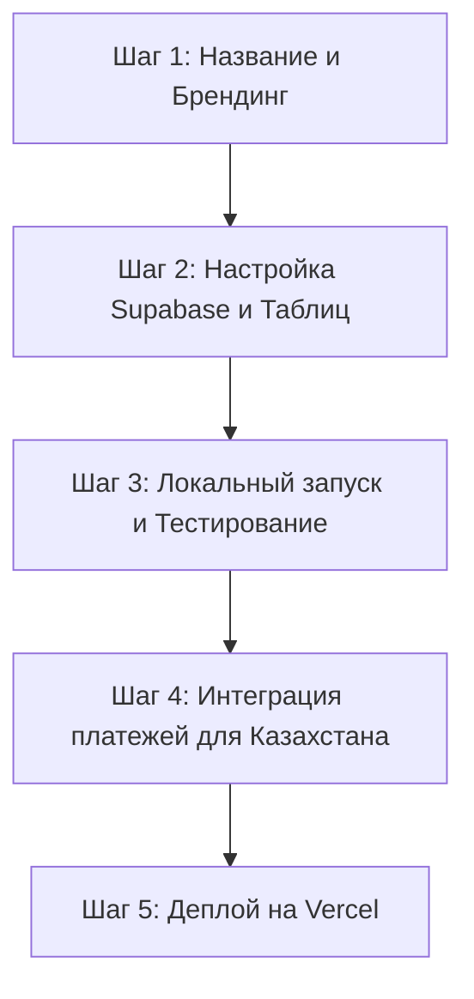

# Создание стартапа игрового маркетплейса в Казахстане (аналог Playrock)

Мы планируем развернуть и настроить полноценный маркетплейс игровых аккаунтов с системой безопасных сделок (эскроу/гарант) и арбитражной панелью.

---

## Анализ базы данных: Почему Supabase — лучший выбор?

Перед началом работы мы сравнили **Supabase** с альтернативами:

| Критерий | **Supabase (PostgreSQL)** | **Firebase (NoSQL)** | **Собственный сервер (Node.js + Postgres)** |
| :--- | :--- | :--- | :--- |
| **Финансовые транзакции** | 🟢 **Идеально**. Поддержка транзакций (ACID), балансов, связей между заказами и пользователями. | 🔴 **Плохо**. Документо-ориентированная база усложняет расчет балансов и защиту от двойного списания. | 🟢 **Идеально**. Полный контроль над транзакциями. |
| **Реал-тайм чат** | 🟢 **Отлично**. Встроенный механизм Realtime через WebSockets. | 🟢 **Отлично**. Realtime Database / Firestore. | 🟡 **Сложно**. Нужно писать и настраивать WebSocket-сервер отдельно. |
| **Авторизация (Auth)** | 🟢 **Отлично**. Готовая регистрация, подтверждение почты, сессии и сброс паролей. | 🟢 **Отлично**. Firebase Auth. | 🔴 **Сложно**. Требуется самостоятельное написание и аудит безопасности JWT/сессий. |
| **Скорость разработки** | 🟢 **Быстро**. Готовый бэкенд, клиенты для Next.js, административная панель. | 🟢 **Быстро**. | 🔴 **Медленно**. Нужно писать API с нуля. |
| **Масштабируемость** | 🟢 **Отлично**. Это стандартный PostgreSQL, в любой момент можно съехать на собственный хостинг. | 🟡 **Ограниченно**. Сложно перенести данные в другую СУБД, привязка к экосистеме Google. | 🟢 **Отлично**. Полная независимость. |

**Вердикт:** **Supabase** — идеальный выбор. Он дает транзакционность классической SQL-базы (что крайне важно для балансов и эскроу-систем) и скорость разработки облачного решения без привязки к вендору (vendor lock-in).

---

## Пошаговый план реализации ("От и До")

### Шаг 1: Название и Брендинг
* Определить название проекта (например, *PlayQaz.kz*, *Loot.kz*, *TengeLoot*).
* Заменить упоминания бренда "SolarLoot" в кодовой базе (в текстах, заголовках, мета-тегах и письмах).

### Шаг 2: Настройка Supabase
* Создать бесплатный проект на [Supabase](https://supabase.com).
* Применить готовую схему базы данных из `supabase_schema.sql` через SQL Editor в консоли Supabase.
* Отключить обязательное подтверждение почты в Supabase для удобства тестирования на этапе разработки.
* Скопировать ключи подключения (`NEXT_PUBLIC_SUPABASE_URL`, `NEXT_PUBLIC_SUPABASE_ANON_KEY`) в файл `.env.local`.

### Шаг 3: Локальный запуск и Тестирование
* Установить зависимости (`npm install`).
* Запустить локальный сервер Next.js (`npm run dev`).
* Зарегистрировать тестовых пользователей (Покупатель, Продавец, Администратор).
* Проверить полный цикл: Создание объявления -> Покупка (блокировка денег в эскроу) -> Переписка в чате -> Подтверждение сделки / Открытие спора и вынесение вердикта в арбитраже.

### Шаг 4: Интеграция платежей для Казахстана
* Создать страницу пополнения баланса и вывода средств.
* Добавить поддержку Kaspi:
  * **Простой вариант:** Отображение реквизитов (Kaspi Gold / Kaspi QR) и ручное зачисление баланса администратором (идеально для MVP).
  * **Продвинутый вариант (в будущем):** Интеграция платежных шлюзов (PayBox / Freedom Pay).

### Шаг 5: Деплой на Vercel
* Загрузить проект в репозиторий GitHub.
* Развернуть проект на Vercel (бесплатный хостинг для Next.js).
* Подключить домен `.kz` (при необходимости).

---

## Открытые вопросы для Пользователя

> [!IMPORTANT]
> 1. **Как мы назовем ваш стартап?** (Какое имя заменить вместо SolarLoot в дизайне и текстах?)
> 2. **Хотите ли вы зарегистрировать базу Supabase прямо сейчас?** Мы можем пошагово пройти этот процесс, чтобы сайт сразу стал функциональным.
